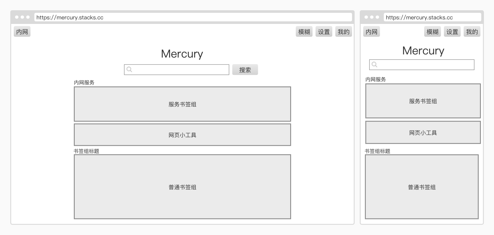

  

  An easy-to-use and private intranet portal

    
    
    
    

    
    
    
    
    

## Progress

- [X] Structure Design
- [X] Interface Design
- [X] Database Design
- [ ] Front-end Development
- [ ] Back-end Development

## Structure

## Interface design

## Screenshot
